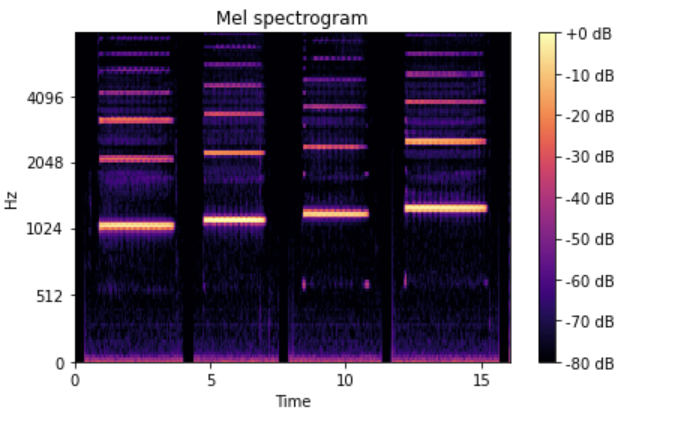
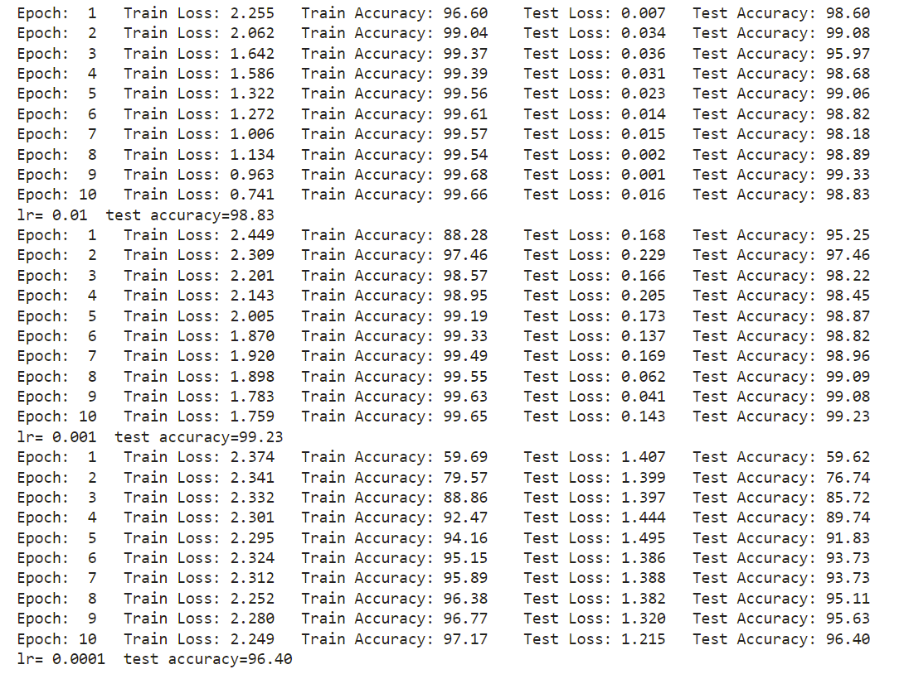
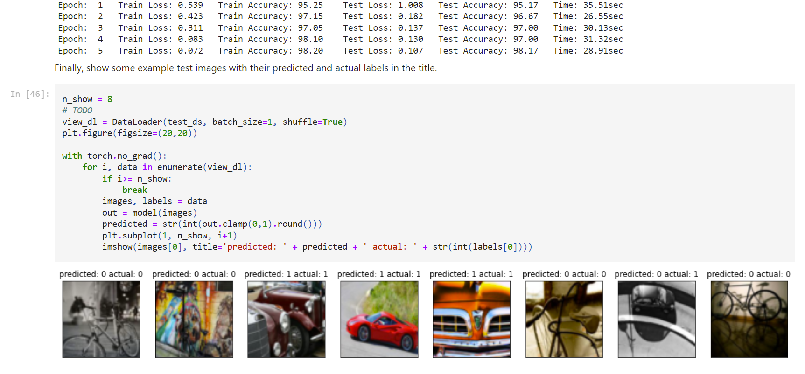
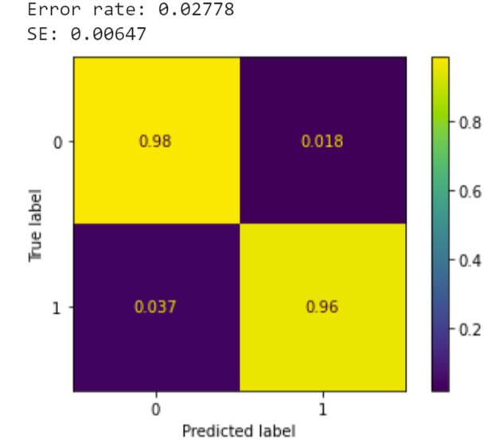

# **Portfolio**

**This page contains brief descriptions and code snippits of past projects. Click on the project for the full code and a more in-depth explanation!**
  

## **1.** [Laser Weld Depth Prediction](https://github.com/julian-irizarry/MachineLearning/tree/main/WeldDepth)

A welding reasearch group constructed a dataset that contained measured weld depth at various laser speeds and power. The group wanted to see if a machine learning model could accurately predict the weld depth if the laser is set to various speeds and power.
  
The methods that produced the best results were a neural network optimized with Optuna and an XGB model with its hyperparameters found using Sklearn's GridSearchCV. 
  

The figure above gives a visual intuition on how the depths of the predicted match up to the actual values. Both figures show that the mean absolute errors are relatively close. The models were evaluated using k-fold cross validation.

  

## **2.** [Neural Networks for Music Classification](https://github.com/julian-irizarry/MachineLearning/tree/main/MusicClassification)

Given a sample of music, the model determines which instrument (e.g. trumpet, violin, piano) is playing.  This dataset was supplied by [Prof. Juan Bello](http://steinhardt.nyu.edu/faculty/Juan_Pablo_Bello) at NYU Stenihardt  and his former PhD student Eric Humphrey (now at Spotify).

<small><i>Mel Frequency Cepstral Coeficients</i></small>

MFCCs represents the frequency and power in the log domain. The figure above shows MFCCs for four notes. The MFCCs are used for the classification of the instruments.

<small><i>Training and Testing Results</i></small>

After optimizing the learning rate, the test accuracy was 99.23%.

  

## **3.** [Image Classification Using VGG16](https://github.com/julian-irizarry/MachineLearning/tree/main/ImageVGG16)

[Transfer Learning](https://en.wikipedia.org/wiki/Transfer_learning) from VGG16 to classify a custom dataset of bikes and cars.  

<small><i>Training and Testing Results</i></small>

  

## **3.** [Logistic Regression Model Classifying Down Syndrome in Mice](https://github.com/julian-irizarry/MachineLearning/tree/main/Logistic)

The data comes from:

https://archive.ics.uci.edu/ml/datasets/Mice+Protein+Expression

In this data, mice were characterized by three properties:

* Whether they had down's syndrome (trisomy) or not.

* Whether they were stimulated to learn or not.

* Whether they had a drug memantine or a saline control solution.

With these three choices, there are 8 possible classes for each mouse. For each mouse, the expression levels were measured across 77 genes. The characteristics can be predicted from the gene expression levels. 

<small><i>Classification Accuracy</i></small>

