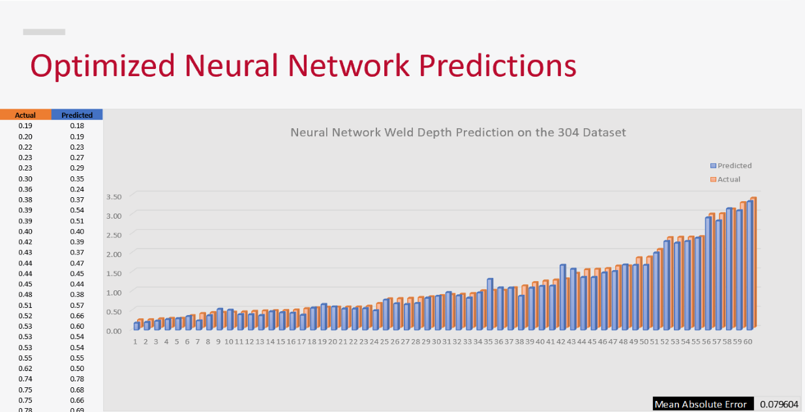

# **Portfolio**

**This page contains brief descriptions and code snippits of past projects. Click on the project for the full code and a more in-depth explanation!**
  

## **1.** [Laser Weld Depth Prediction](https://github.com/julian-irizarry/MachineLearning/tree/main/WeldDepth)

A welding reasearch group constructed a dataset that contained measured weld depth at various laser speeds and power. The group wanted to see if a machine learning model could accurately predict the weld depth if the laser is set to various speeds and power.
  
The methods that produced the best results were a neural network optimized with Optuna and an XGB model with its hyperparameters found using Sklearn's GridSearchCV. 
  

The figure above gives a visual intuition on how the depths of the predicted match up to the actual values. Both figures show that the mean absolute errors are relatively close. The models were evaluated using k-fold cross validation.

  

## **2.** [Neural Networks for Music Classification]()

Your Pages site will use the layout and styles from the Jekyll theme you have selected in your [repository settings](https://github.com/julian-irizarry/MachineLearning/settings/pages). The name of this theme is saved in the Jekyll `_config.yml` configuration file.

  

## **3.** [Image Classification Using VGG16]

Having trouble with Pages? Check out our [documentation](https://docs.github.com/categories/github-pages-basics/) or [contact support](https://support.github.com/contact) and we’ll help you sort it out.
